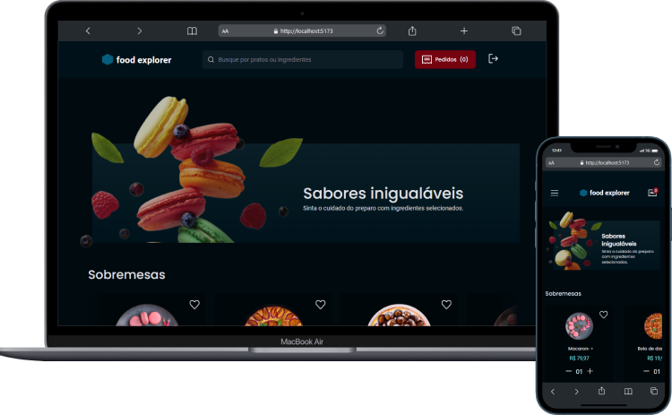

Explorer Food Front-End



O FoodExplorer é uma aplicação fullstack, utilizando as tecnologias aprendidas durante o curso Explorer, simulando um restaurante fictício de acordo com o layout disponibilizado no Figma.

O food explorer possui duas personas: o admin e o usuário;

O admin é a pessoa responsável pelo restaurante e tem o acesso para criar, visualizar, editar, apagar um prato e alterar os status de pedidos a qualquer momento. Cada prato deve conter uma imagem, nome, categoria, descrição, ingredientes e o seu preço. Ao clicar em adicionar ou editar prato será redirecionado para a página e ao finalizar receberá uma mensagem de sucesso e será redirecionado para a página principal.

O usuário irá visualizar todos os pratos cadastrados, adicionar ao carrinho, fazer um pedido, adicionar aos favoritos, acompanhar seu histórico de pedidos, atualizar seu perfil e quando clicar em um prato, será redirecionado para uma nova tela com informações mais detalhadas sobre ele.
<br/>

<p align="center">
  <a href="#memo-licença">
    
  </a>
  
  <a href="https://app.netlify.com/sites/foodexplorer-douloficial/deploys">
    
  </a>
  
  <a href="#-backend">
    
  </a> 
</p>


<p align="center">
Frontend do projeto Food Explorer</p>

<p align="center">
  <a href="#-deploy">Deploy</a>&nbsp;&nbsp;&nbsp;|&nbsp;&nbsp;&nbsp;
  <a href="#-backend">Backend</a>&nbsp;&nbsp;&nbsp;|&nbsp;&nbsp;&nbsp;
  <a href="#-tecnologias">Tecnologias</a>&nbsp;&nbsp;&nbsp;|&nbsp;&nbsp;&nbsp;
  <a href="#-projeto">Projeto</a>&nbsp;&nbsp;&nbsp;|&nbsp;&nbsp;&nbsp;
  <a href="#-layout">Layout</a>
<!--   <a href="#memo-licença">Licença</a>&nbsp;&nbsp;&nbsp;|&nbsp;&nbsp;&nbsp; -->
</p>

## 🚀 Deploy

O projeto está hospedado na **Netlify** e pode ser acessado em:
- [FoodExplorer-dsouloficial.netlify.app](https://foodexplorer-dsouloficial.netlify.app/)

Para efetuar login na aplicação, utilize as credenciais abaixo:

**Administrador**:
  - login: `admin@email.com`
  - senha: `123456`

**Usuário**:
  - login: `user@email.com`
  - senha: `123456`

### Deploy local

1. Para executar o projeto localmente é necessário que primeiro seja feito o deploy do backend da aplicação, acesse o repositório
[Github.com/dsouloficial/foodexplorer-api](https://github.com/dsouloficial/foodexplorer-api#%EF%B8%8F-deploy-local) e siga as instruções de deploy local.

2. Faça o clone do projeto em uma pasta local através do prompt de terminal:
```bash
git clone https://github.com/dsouloficial/foodexplorer.git
```
3. Acesse a pasta:
```bash
cd foodexplorer
```
4. Instale as dependencias do projeto
```bash
npm install
```
5. Execute o servidor da aplicação:
```bash
npm run dev
```
6. Acesse o endereço de *localhost* que é mostrado no prompt, conforme o exemplo abaixo
```
  VITE v4.2.1  ready in 4478 ms

  ➜  Local:   http://localhost:5173/
```

## 🔙 Backend

O backend desta aplicação encontra-se no repositório: 
- [github.com/dsouloficial/ExplorerFood-Backend.git](https://github.com/dsouloficial/ExplorerFood-Backend.git)

## 🦾 Tecnologias

Esse projeto foi desenvolvido com as seguintes tecnologias:

- [Axios](https://axios-http.com/)
- [Keen-Slider](https://keen-slider.io/)
- [React-currency-input-field](https://github.com/cchanxzy/react-currency-input-field)
- [React](https://react.dev/)
- [React-router](https://reactrouter.com/)
- [React-icons](https://react-icons.github.io/react-icons)
- [Styled-components](https://styled-components.com)
- [Vite.js](https://vitejs.dev)

## 💻 Projeto

O Food Explorer é um projeto criado como parte do desafio final do curso Explorer da [@Rockeseat](https://www.rocketseat.com.br/) para avaliar os conhecimentos adquiridos pelo aluno.

## 🔖 Layout

O layout Figma do projeto pode ser visualizado através do seguinte link:  
- [Figma.com/file/YkAg3miDsja6W4qTzIMdbB/food-explorer-v2](https://www.figma.com/file/YkAg3miDsja6W4qTzIMdbB/food-explorer-v2-(rocketseat)?node-id=0%3A1&viewer=1).

## :memo: Licença

Esse projeto está sob a licença MIT.

---
## Autor  

<a href="https://github.com/dsouloficial/">
    
</a> 


## Contatos  

  <a href="https://www.linkedin.com/in/Denilson-Bernardo/">
    
  </a> 
  <br/><br/>
  <a href="mailto:denilsonbnascimento07@gmail.com">
    
  </a> 
 
